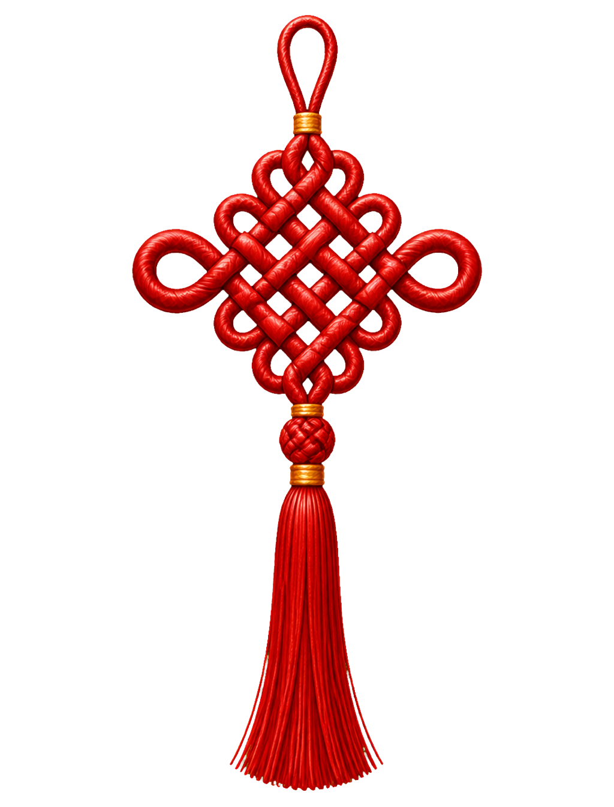
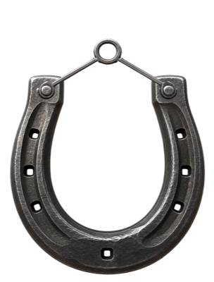
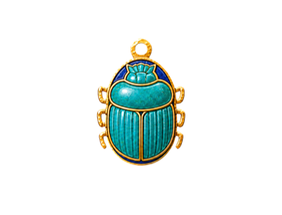

# Lucky Dangle

A lucky charm for your screen.
Choose a charm and hang it from the top of your screen, on Mac or Windows. It sways while you work, stays out of every click, and drops in when you call it.
Try the charm: grab it and give it a flick.

<video src="assets/mac-demo.mp4" width="100%" controls autoplay loop></video>

## Choose your charm
Each one comes from a tradition around the world, with a small ritual of its own. Pick a charm to hang it on this page.

### Nazar boncuğu

Turkey and the Mediterranean
A glass eye worn against the evil eye. Give it a flick when you want a little cover.

### Hamsa

Middle East and North Africa
An open hand carried for protection and good fortune. Give it a flick to send bad luck on its way.

### Nimbu-mirchi

India
Seven chilies and a lemon hung at the threshold to turn away misfortune. Replace it with a fresh one when the week is up.

### Ghanta

India
A bell rung to clear the air and mark a beginning. Ring it when you make a wish, or before something that matters.

### Drishti bommai

South India
A fierce guardian painted to meet the first bad glance. Repaint it through seven colors whenever you want a fresh start.

### Páncháng jié

China
One unbroken red cord tied for good fortune without end. Cinch it gently and let the tassel settle.

### Daruma

Japan
A wishing doll for goals that take some grit. Paint one eye when you make a wish and the other when it comes true.

### Maneki-neko

Japan
A beckoning cat that invites good fortune in. Call on it and watch its raised paw wave.

### Horseshoe

Europe and the Americas
Hung points up so the luck stays put. A good flick is all this one needs.

### Scarab

Ancient Egypt
An ancient amulet for renewal and new beginnings. Spread its ceremonial wings for a moment, then let them rest.

### Himmeli

Finland
A rye-straw tradition for inviting abundance, prosperity, and a fruitful flow of work. Set its open geometry turning on an imagined current of air.

### 🍀 Emoji
Yours
Choose any emoji and make the ritual your own. Hang the one that feels lucky to you.

Missing the charm you grew up with? [Suggest a dangle.](mailto:hello@luckydangle.com?subject=Suggest%20a%20dangle) New charms arrive in free updates.

## At home on your Mac or PC
Lucky Dangle lives in the menu bar on Mac and the tray on Windows, and leaves the rest of your machine alone.
- Stays in the menu bar on Mac and the tray on Windows, with no Dock icon or open window.
- Only the charm catches your cursor. Everything else clicks straight through.
- Keyboard shortcuts dangle it or perform its ritual. On the Mac, choose your own.
- Drag it along the top edge to re-hang it anywhere on your screen.
- Meet every charm and its story in the built-in gallery.
- New charms arrive through free, built-in updates.

## Make it yours
Leave it there for company or call it down when the moment needs something extra.

🪟 **Keep it close**
It hangs quietly at the top of your screen and never gets in the way. On crowded days on the Mac, send it behind your windows and it keeps watch from the desktop.

⌨️ **Call it down**
Hide it on ordinary days. Bring it back before a deploy, demo, interview, or anything else that could use some luck. Here, ⌃D toggles it and ⌃S performs its ritual.

🎯 **Give it a ritual**
Paint the daruma's eye. Replace a tired garland. Repaint the guardian. Every charm has one small thing it can do.

💬 **Share the story**
It shows up in screenshots and screen shares. When someone asks, you have a story to tell.

## Bless a moment
Lucky Dangle also listens for luckydangle://. Add one line to a script, shortcut, or git hook and the charm comes forward, drops in, and performs its ritual right on cue.
`# before a deploy, a demo, a big meeting start luckydangle://bless`

---
*Note: You can download the `.exe` and `.msi` installers directly from this repository's releases or files.*
